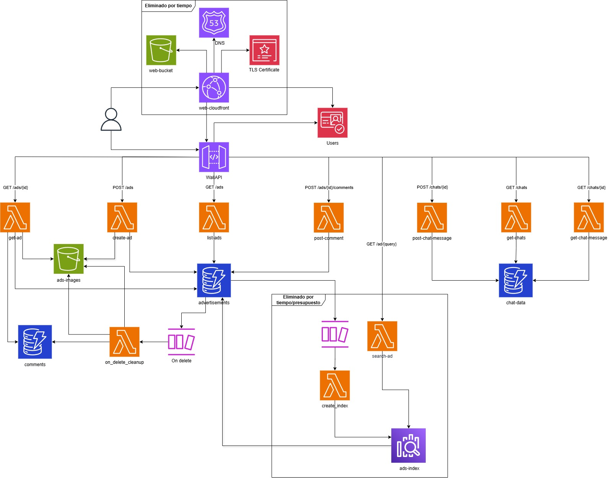

# Sergio Yunta Martín - Wallaserverless

Esta es la documentación del proyecto del módulo `Cloud` del máster de Datahack  

## Toda la documentación

- [Diagrama de la arquitectura](#diagrama-de-la-arquitectura)
- [Decisiones de diseño](docs/decisiones_de_diseno.md)
- [Manual de despliegue](#manual-de-despliegue)
- [Creación de usuarios](docs/creacion_usuarios.md)
- [Testing](docs/testing.md)


## Diagrama de la arquitectura
El diagrama de la arquitectura, en AWS es el siguiente:



Se han intentado usar tecnologías serverless para todos los componentes de la arquitectura, esto en más detalle, junto con la separación por constructos está en el apartado de [decisiones de diseño](docs/decisiones_de_diseño.md)

## Manual de despliegue
Se ha intentado automatizar el despliegue lo máximo posible, para ello, se ha creado un `Makefile` y un `docker-compose.yaml` para automatizar las dependencias y evitar la necesidad de instalar nada.

Para ello, se ha seguido el ejemplo del repositorio https://github.com/chrishart0/aws-cdk-typescript-3-musketeers, donde se ha tomado la base y se ha editado para usar python, lo que pretende agilizar el proceso.

### Despliegue en una nueva cuenta
Para desplegar en una nueva cuenta, como este proyecto está escrito con CDK, se tiene que hacer un paso previo al despliegue llamado bootstrapping. Esto se debe hacer una vez por cuenta, por lo que si ya has desplegado alguna vez un proyecto de CDK puedes ignorar este paso.

> **Nota**: necesitamos como paso previo tener nuestro awscli configurado correctamente.

> **Nota 2**: todos estos procesos se han realizado con permisos de Administrador en la cuenta (AdministratorAccessAD), no se han estudiado los permisos específicos.

Antes de nada, hay que editar el fichero `.env` con el número de la cuenta en la que queremos desplegar, la región y el fichero de configuración que queremos usar que tiene que ser una de las opciones que se encuentren en `src/config/`. (Recomiendo usar `pro.yaml` por si hay algún problema de nombre en el bucket, ya que tarda en borrarlo de los registros).

Ahora sí, para empezar, necesitamos tener la imagen construida:

```bash
make container-build
```

Una vez se ha construido la imagen, podemos ejecutar el comando de bootstrapping:

```bash
make bootstrap
```

Con esto, se nos desplegará un stack inicial en Cloudformation llamado `CDKToolkit`. Con esto ya estamos listos, solo falta:

```bash
make deploy
```

### Despliegue habitual
De manera normal (si hay se ha hecho bootstrapping), teniendo en cuenta las notas del apartado anterior, bastaría con ejecutar:

```bash
make container-build
make deploy
```

## Otros manuales
Se recomiendan revisar los manuales en la carpeta `docs/`


