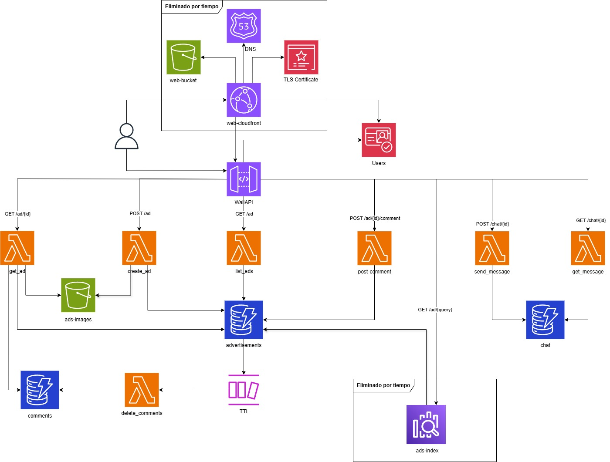

# Decisiones de diseño y constructos

Para recordar el diagrama, la arquitectura ha quedado así.

En este apartado se explicarán varias decisiones que se han tenido en cuenta a la hora de diseñarlo.

## Usuarios
La gestión de usuarios está explicada en [Creación de usuarios](./creacion_usuarios.md).

Ver constructo `src/users`.

## API

La API es algo que estaba bastante claro, es prácticamente un estándar en AWS usar API Gateway y la integración con Lambda.

Para la parte de autenticación y autorización se ha usado Cognito y el autorizador de Cognito ya que sirve para automatizar la comprobación de los tokens de acceso. La autorización se ha hecho dentro del endpoint, no es lo más óptimo, pero es una simplificación que cumple para este tipo de proyectos.

Toda esta funcionalidad se ha agrupado en un constructo llamado `api/` dentro de `src/`.

## Imágenes
Para las imágenes de los anuncios, se ha tomado la decisión de restringirlo a una imagen por anuncio.

Esto facilita mucho su almacenamiento, ya que al ser objetos se ha elegido un almacenamiento en S3 y basta con guardar el fichero con el identificador del anuncio.

Esto tiene una contraparte, que los ficheros con el nombre que ha elegido el usuario se pierden, pero son más sencillos de gestionar.

Ver constructo `src/images`.

## Bases de datos
Queremos algo que no genere mucho coste si no se está usando, por lo que tenemos que buscar una solución serverless, no necesitamos además mucha funcionalidad, así que DynamoDB parece una opción óptima para este caso. Además, el patrón de acceso a los datos en muchos casos es por medio de una clave.

Se han creado tres tablas de Dynamo, una para los anuncios, otro para los comentarios de los anuncios y otro para los mensajes de los chats.

- `advertisements`: Almacena información de los anuncios, esto es:
  - `ad_id`: string, partition key, identificador del anuncio.
  - `author`: string, usuario que ha creado el anuncio (asignado al grupo de cognito `advertisers-group`).
  - `description`: string, descripción del anuncio.
  - `price`: integer, precio del producto ofrecido.
  - `title`: string, título del anuncio.
  - `creationDate`: integer, timestamp con la creación del anuncio.
  - `expireAt`: integer, timestamp con expiración del anuncio.

- `comments`: Almacena información de los comentarios, esto es:
  - `ad_id`: string, partition key, identificador del anuncio al que pertenecen.
  - `author`: string, usuario que ha publicado el comentario.
  - `comment`: string, contenido del comentario.
  - `timestamp`: string, sort key, timestamp con el tiempo de publicación.
  - `title`: string, título del anuncio.
  - `creationDate`: integer, timestamp con la creación del anuncio.
  - `expireAt`: integer, timestamp con expiración del anuncio.

- `chat`: Almacena información de los anuncios, esto es:
  - `chat_id`: string, partition key, identificador del anuncio.
  - `author`: string, usuario que ha mandado el mensaje.
  - `message`: string, contenido del mensaje.
  - `destination`: string, usuario al que está destinado el mensaje.

Ver constructo `src/databases`.

## Limpieza y consistencia
Para mantener la consistencia de los datos, se han usado los DynamoDB streams, que van a lanzar una lambda con los registros que se han borrado, para poder gestionar el borrado de comentarios y de imágenes del almacenamiento, manteniendo así la consistencia de los datos.

Esto también aplica a cuando los ítems de la dynamo expiren, tardan unos días en borrarse realmente, pero para este caso no es crítico.

Otra opción podría haber sido implementar un evento periódico que vea qué items se han borrado para eliminar los restos de los mismos en el resto de almacenamientos.

## Web (eliminada por tiempo)
La parte de la web se ha eliminado por falta de tiempo.

La idea sería desplegarlo en S3 con una CDN como Cloudfront para servirlo por un canal seguro de comunicaciones. Además, la configuración de la distribución de cloudfront permite configurar cabeceras de seguridad así como la versión de tls y la suite de cifrado.

Por otro lado, para el certificado necesitaríamos un dominio gestionado en AWS, que se ha omitido por presupuesto. Además, crear una Hosted Zone en Route53 para gestionarlo, y validar el certificado de ACM.

## Query (eliminada por tiempo/presupuesto)
La parte de la búsqueda de anuncios se ha eliminado por falta de tiempo/presupuesto ya que incurre en coste cualquier aproximación.

La idea sería usar opensearch para indexar los anuncios y poder realizar búsquedas sobre ellos.
