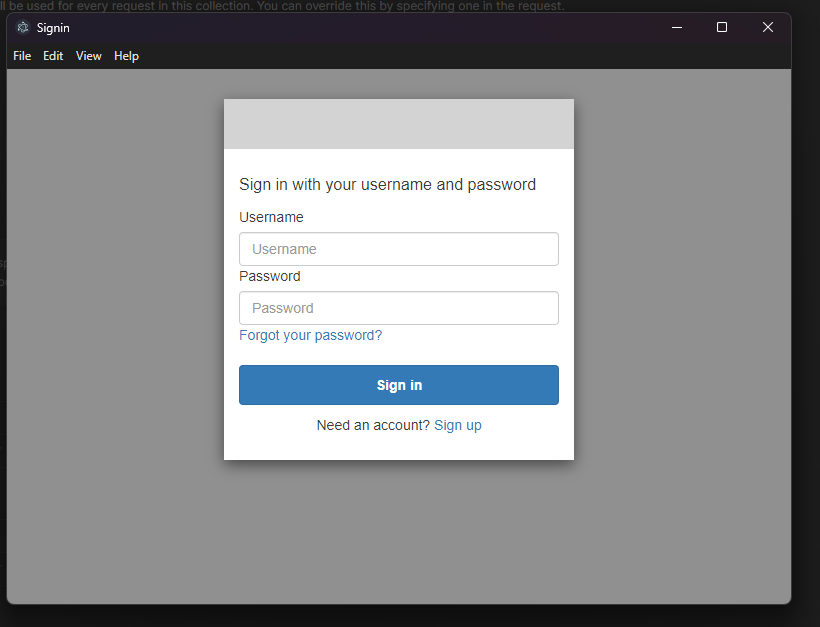
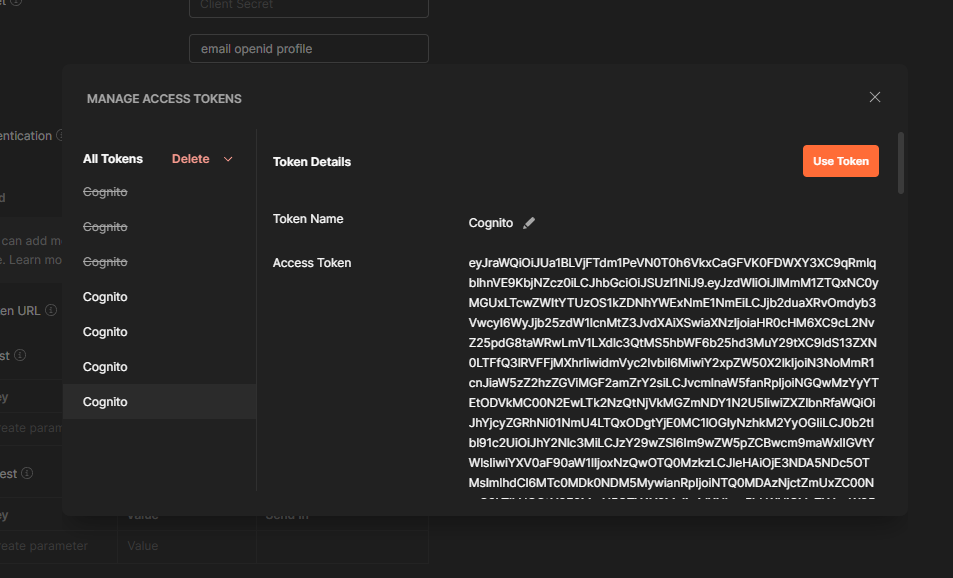

# Testing
Se ha creado una colección de postman para probar la API (se encuentra en `tests/SY-WallaSLS.postman_collection.json`)

No se ha realizado ningún testing automático.

## Cosas a tener en cuenta

### Inicio de sesión
Para cambiar de usuario, hay que hacer login con los que deseemos. Para ello hay que ir a la raíz de la colección, a la parte de authorization.

Primero! Si se ha desplegado con otra configuración en otra cuenta, hay que ir al apartado de `Auth URL` y `Access Token URL`:

Por ejemplo, desplegado con la configuración `dev.yaml`:

- `Auth URL`: https://sy-walla-dev.auth.eu-west-1.amazoncognito.com/oauth2/authorize 
- `Access Token URL`: https://sy-walla-dev.auth.eu-west-1.amazoncognito.com/oauth2/token

Con la configuración `pro.yaml`:

- `Auth URL`: https://sy-wallaaaa-pro.auth.eu-west-1.amazoncognito.com/oauth2/authorize 
- `Access Token URL`: https://sy-wallaaaa-pro.auth.eu-west-1.amazoncognito.com/oauth2/token

Por lo tanto, el patrón es:

- `Auth URL`: https://`<config.name>`-`<config.stage>`.auth.eu-west-1.amazoncognito.com/oauth2/authorize 
- `Access Token URL`: https://`<config.name>`-`<config.stage>`.auth.eu-west-1.amazoncognito.com/oauth2/token

Con esto configurado, si vamos al final, le damos al botón de `Clear Cookies` y luego a `Get New Access Token`.

Esto abrirá una web:

Cuando metamos los credenciales correctamente y esperar unos segundos, veremos:

Si le damos a `Use Token`, ya podremos usar la API con nuestro usuario.
